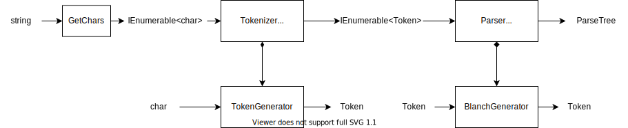

# 0.基本設計

## 機能要件

本ライブラリは、四則演算で書かれた数式文字列の意味を解析して、計算するライブラリである。

### 基本構文
  
ここで四則演算とは、加算(`+`)、減算(`-`)、乗算(`*`)、除算(`/`)のことをさす。

数式は、符号、数字文字列、演算文字およびスペースからなる文字列とする。
構文は以下の通り、

```
```

## 基本データフロー

### 全体フロー




### Tokenizer

### Parser

### TokenGenerator

### BlanchGenerator


