# 0.基本設計

## 機能概要

本ライブラリは、四則演算で書かれた数式文字列の意味を解析して、計算するライブラリである。

## 基本構文
  
ここで四則演算とは、加算(`+`)、減算(`-`)、乗算(`*`)、除算(`/`)のことをさす。

数式は、符号、数字文字列、演算文字およびスペースからなる文字列とする。
構文は以下の通りである。

| 項目名     | 定義                                                              |
| ---------- | ----------------------------------------------------------------- |
| 空白文字列 | 空白文字(`0x20`)だけからなる文字列                                |
| 符号文字   | `'+'`または`'-'`                                                  |
| 数字文字列 | `'0'`から`'9'`までの文字からなる文字列で`'0'`ではじまらない文字列 |
| 演算文字   | `+`、`-`、`*`、`/`のいずれかの文字                                |

> 上記項目のうち、空白文字列以外の事を総称して **トークン(`Token`)** と呼ぶ。

## 例外処理

| 事象                         | 発生する例外               |
| ---------------------------- | -------------------------- |
| 予期せぬトークンが見つかった | `UnexpectedTokenException` |
| 予期せぬ文字が見つかった     | `UnexpectedCharException`  |

## 実行結果サンプル

| 入力         | 出力 |
| ------------ | ---- |
| `1`          | `1`  |
| `-1`         | `-1` |
| `+1`         | `1`  |
| `1+1`        | `2`  |
| `2-4`        | `-2` |
| `3*4`        | `12` |
| `1+3*3+1`    | `8`  |
| `2*2 + 4* 3` | `16` |

