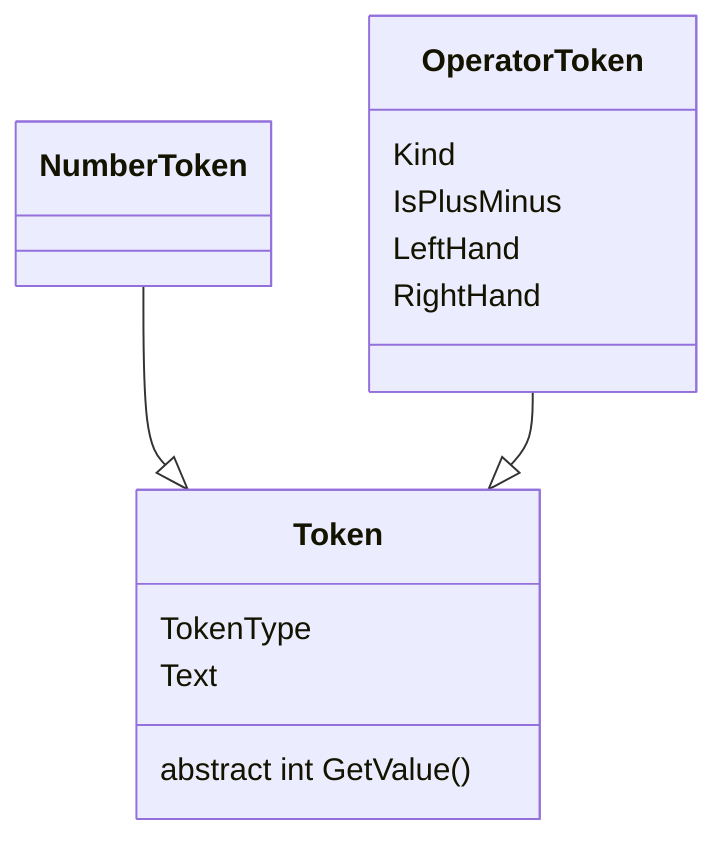
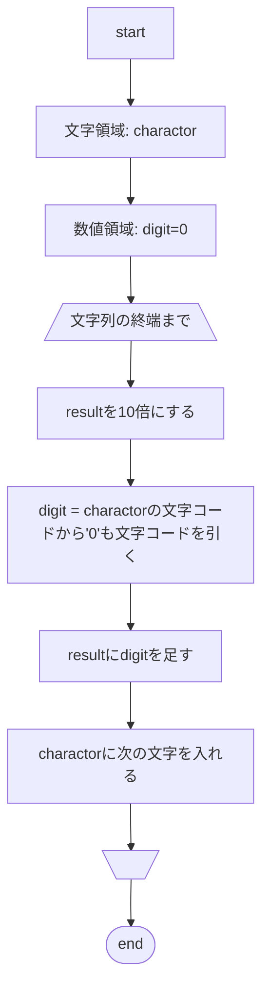

# `Token`

## アーキテクチャ

## クラス明細

### `NumberToken`

#### `GetValue()` 処理フロー

### `OperatorToken`

#### `GetValue()` デシジョンテーブル

| `LeftHand` | `Kind`     | `RightHand` | 処理                    |
| ---------- | ---------- | ----------- | ----------------------- |
| null       | Any        | null        | Error                   |
| _          | Any        | null        | Error                   |
| null       | Plus/Minus | _           | RightHandに符号をつける |
| null       | Other      | _           | Error                   |
| _          | Any        | _           | 演算処理をする          |

