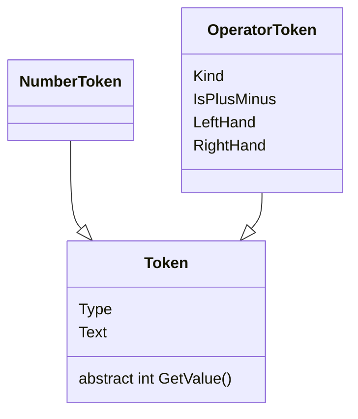
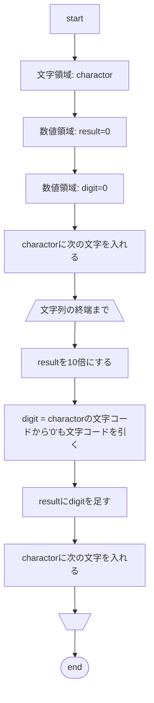
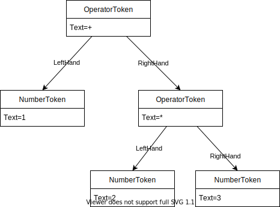

# 詳細設計(`Token`)

## アーキテクチャ

## クラス明細
### `Token`

#### 機能概要

トークンを表すクラス。トークンの型(`Type`)、トークン内の文字列(`Text`)を保存する。プロパティを解析することで値を得る機能(`GetValue()`)を持つ。

#### パブリックメンバ一覧

| 識別子       | 型          | 概要                                               |
| ------------ | ----------- | -------------------------------------------------- |
| `Type`       | `TokenType` | トークンの型、オペレータ文字列か数字文字列かを示す |
| `Text`       | `string`    | トークン文字列                                     |
| `GetValue()` | `int`       | トークンの値。抽象メソッド、継承クラスで実装する。 |

### `NumberToken`

#### 機能概要

数字文字列トークンを表すクラス。`Text`プロパティの文字列を解析して数字型(`int`)に変換する機能(`GetValue()`)を有する。

#### `GetValue()` 処理フロー

### `OperatorToken`

#### 機能概要

オペレータトークンを表すクラス。演算子の左手(`LeftHand`)と右手(`RightHand`)を演算子にしたがって演算を行う機能(`GetValue()`)を有する。

#### `GetValue()` デシジョンテーブル

| `LeftHand` | `Kind`     | `RightHand` | 処理                    |
| ---------- | ---------- | ----------- | ----------------------- |
| null       | Any        | null        | Error                   |
| _          | Any        | null        | Error                   |
| null       | Plus/Minus | _           | RightHandに符号をつける |
| null       | Other      | _           | Error                   |
| _          | Any        | _           | 演算処理をする          |

