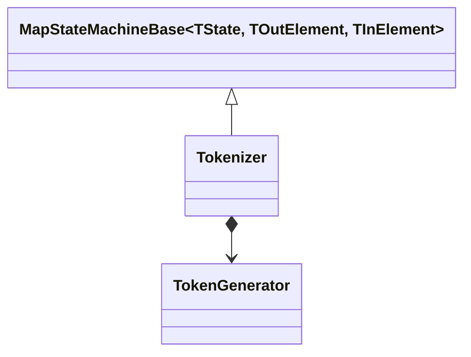
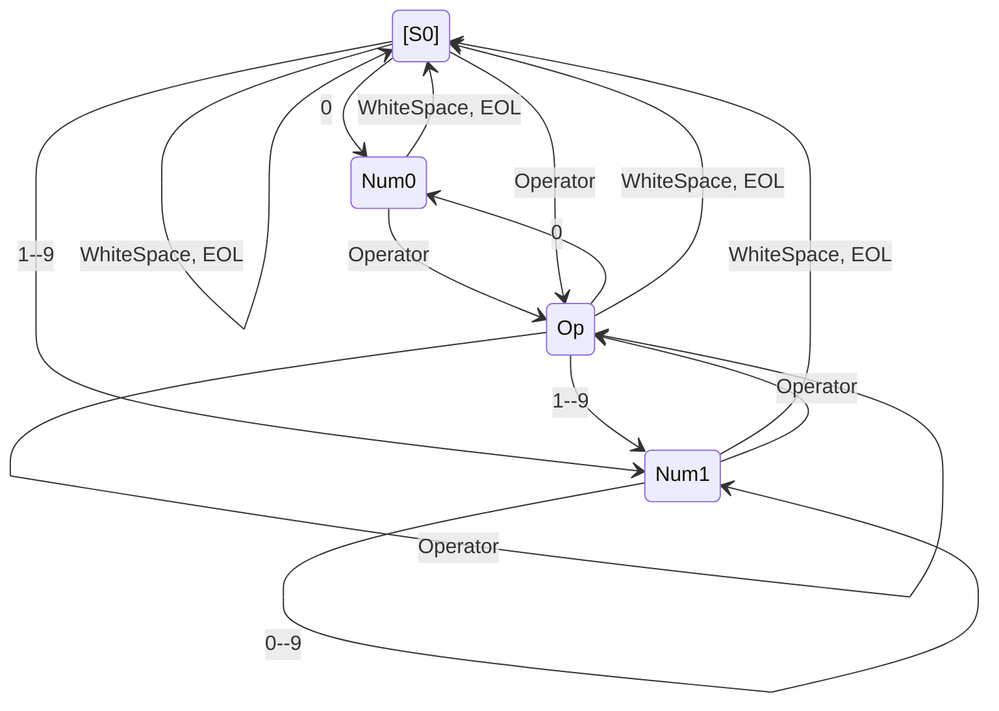
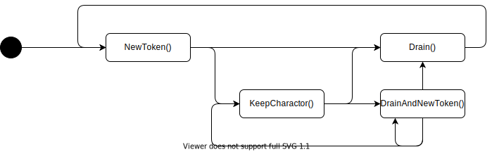

# 詳細設計(`Tokenizer`)

## 概要

文字列からトークンの切り出しを担うのが、`Tokenizer`である。
`Tokenizer`は順に入力された一文字を入力としてステートマシンとして動作し、トークンの列を出力する。

ステートマシンとして動作するため、状態変数型として`TokenizeState`を使い、`char`を入力型、`Token`を出力型とする`MapStateMachineBase`の具象クラスとして実装する。



## Tokenizer

### `TokenizeState`(状態一覧)

| 状態 | Enum値 | 概要                    |
| ---- | ------ | ----------------------- |
| [S0] | S0     | 初期状態                |
| Num0 | Num0   | 数字`0`後区切り待ち状態 |
| Num1 | Num1   | 数字`0`後区切り待ち状態 |
| Op   | Op     | 演算子後区切り待ち状態  |

### `GetNextState()`(状態遷移図)



### `ElementMap()`(デシジョンテーブル)

遷移後は、`TokenGenerator`の各メソッドを実行し、`Token`を得て、返却する。

| 状態     | `0`                  | `1`--`9`           | Operator(`+`,`-`,`*`,`/`) | WhiteSpace(`0x20`) | EOL(`\0`) |
| -------- | -------------------- | ------------------ | ------------------------- | ------------------ | --------- |
| **S0**   | `NewToken()`         | `NewToken()`       | `NewToken()`              | -                  | -         |
| **Num0** | *error*              | *error*            | `DrainAndNewToken()`      | `Drain()`          | `Drain()` |
| **Num1** | `Keep()`             | `Keep()`           | `DrainAndNewToken()`      | `Drain()`          | `Drain()` |
| **Op**   | `DrainAndNewToken()` | `DrainAndNewToken` | `DrainAndNewToken()`      | `Drain()`          | `Drain()` |

## TokenGenerator

### クラス仕様

`TokenGenerator`は`NewToken()`/`Keep()`/`Drain()`/`DrainAndNewToken()`で入力された、文字`char`とトークン型をキャッシュし、
`Drain()`/`DrainAndNewToken()`でトークンを取り出す。


### API仕様

#### NewToken

```csharp
public Token? NewToken(TokenType type, char character)
```

`type`で指定したトークン型とトークンの１文字目でトークン生成の準備をする。

> 常に`null`を返却する

#### Keep

```csharp
public Token? Keep(char character)
```

トークンの２文字目以降を記憶する。

> 常に`null`を返却する

#### Drain

```csharp
public Token Drain()
```

記憶しているトークンを返却し、バッファを空にする。

#### DrainAndNewToken

```csharp
public Token DrainAndNewToken(TokenType nextTokenType, char nextCharacter)
```

記憶しているトークンを返却すると同時に、`type`で指定したトークン型とトークンの１文字目でトークン生成の準備をする。

#### 注意

本クラスのメソッドは下記の順で呼ばれることを想定する。


