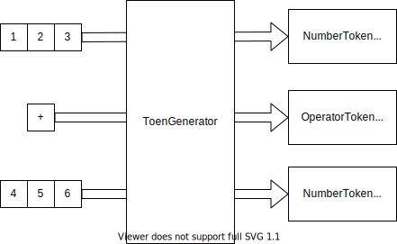

# 詳細設計(`Tokenizer`)

## 概要
文字列からトークンの切り出しを担うのが、`Tokenizer`である。
`Tokenizer`は順に入力された一文字を入力としてステートマシンとして動作し、トークンの列を出力する。

## Tokenizer

### 状態一覧

| 状態 | Enum値 | 概要                    |
| ---- | ------ | ----------------------- |
| [SO] |        | 初期状態                |
| Num0 |        | 数字`0`後区切り待ち状態 |
| Num1 |        | 数字`0`後区切り待ち状態 |
| Op   |        | 演算子後区切り待ち状態  |

### 状態遷移図(`GetNextState()`)

### 状態による処理(`ElementMap()`)

| 状態     | 0                  | 1--9               | Operator           | WhiteSpace | EOL     |
| -------- | ------------------ | ------------------ | ------------------ | ---------- | ------- |
| **S0**   | `NewToken`         | `NewToken`         | `NewToken`         | -          | -       |
| **Num0** | *error*            | *error*            | `DrainAndNewToken` | `Drain`    | `Drain` |
| **Num1** | `KeepCharacter`    | `KeepCharacter`    | `DrainAndNewToken` | `Drain`    | `Drain` |
| **Op**   | `DrainAndNewToken` | `DrainAndNewToken` | `DrainAndNewToken` | `Drain`    | `Drain` |

## TokenGenerator

### クラス仕様

### API仕様

#### NewToken

#### KeepCharcter

#### Drain

#### DrainAndNewToken
