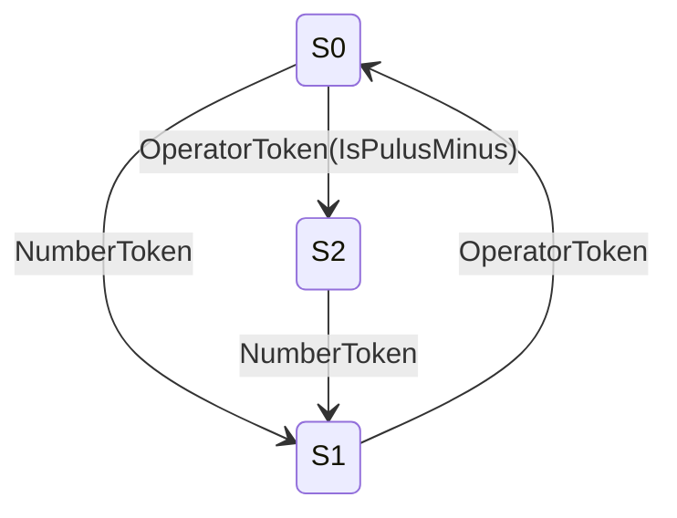

# 詳細設計(`Parser`)

## 状態遷移図

## 状態遷移表

| 状態 | NumberToken  | OperatorToken(IsPlusMinus) | OperatorToken(Other) |
| ---- | ------------ | -------------------------- | -------------------- |
| S0   | AppendToTree | SetSign                    | Error                |
| S1   | Error        | SetOperator                | SetOperator          |
| S2   | AppendToTree | Error                      | Error                |

