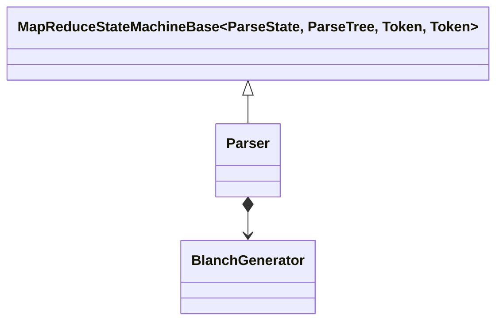
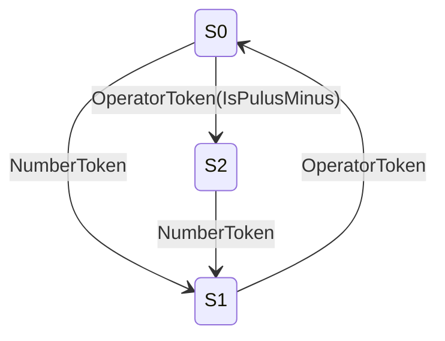
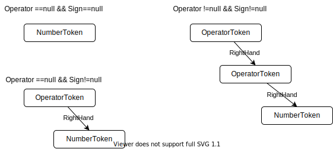

# 詳細設計(`Parser`)

## 概要

切り出したトークンを解釈し、数式の意味を抽出するのが、`Parser`である。
`Parser`は順に入力されたトークンを入力としてステートマシンとして動作し、トークンの列を出力する。

ステートマシンとして動作するため、状態変数型として`ParseState`を使い、`Token`を入力型、`Token`を中間出力型、`ParseTree`を最終出力型とする`MapReduceStateMachineBase`の具象クラスとして実装する。

## Parser

### `ParseState`(状態一覧)

| 状態 | Enum値 | 概要                             |
| ---- | ------ | -------------------------------- |
| [S0] | S0     | 初期状態                         |
| S1   | S1     | 演算子または数字トークン待ち状態 |
| S2   | S2     | 数字トークン待ち状態             |

### `GetNextState()`(状態遷移図)

### `ElementMap()`(デシジョンテーブル)

状態と入力トークンの種別に合わせて`BlanchGenerator`の各メソッドを呼び出すことで、構文木(Tree)の枝(Blanch)を生成する。

| 状態 | NumberToken    | OperatorToken(IsPlusMinus) | OperatorToken(Other) |
| ---- | -------------- | -------------------------- | -------------------- |
| S0   | GenerateBlanch | SetSign                    | Error                |
| S1   | Error          | SetOperator                | SetOperator          |
| S2   | GenerateBlanch | Error                      | Error                |

### ElementReduce()

`ParseTree.AppendBlanch()`を呼び出す。

## `BlanchGenerator` 

`SetOperator()`、`SetSign()`で指定した演算子と符号で、`GenerateBlach`で追加する`NumberToken`を元に、次にTreeに追加する枝を生成する。

`BlanchGenerator.GenerateBlanch()`で生成される枝の構造を下記に示す。

