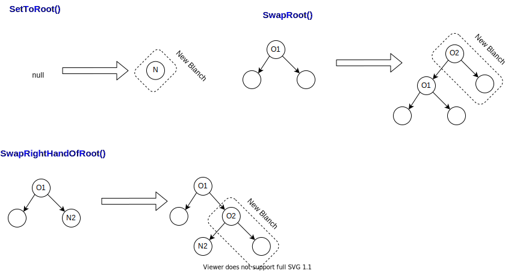

# 詳細設計(`ParseTree`)

## 機能概要

`Parser`の処理結果を表すクラス。Parserで切り出した枝をつなぎわせる機能を有する。
枝の`Token`の型やオペレータの場合その演算子の種別によって枝のつなぎ先を切り替える。

こうして、得られた`ParseTree`の `RootToken`を参照し、`GetValue()`を実行する事で、計算結果を得る。

> 枝のつなぎ先を切り替えることは、演算子の実行優先度を変える事を意味する。

## ブランチの追加

ブランチの追加は、`AppendBlanch()`メソッドが担う。`AppendBlanch()`メソッドは、下記のデシジョンテーブルにしたがって、Privateな追加メソッドを呼び出し、枝をつなぐ。

### デシジョンテーブル

| RootToken/BlanchToken | Operator(`+`/`-`) | Operator(`*`/`/`)     | Number          | Other           |
| --------------------- | ----------------- | --------------------- | --------------- | --------------- |
| null                  | SetToRoot()       | SetToRoot()           | SetToRoot()     | UnexpectedToken |
| Number                | SwapRoot()        | SwapRoot()            | UnexpectedToken | UnexpectedToken |
| Operator              | SwapRoot()        | SwapRightHandOfRoot() | UnexpectedToken | UnexpectedToken |

### Privateな追加メソッド

| メソッド名              | 追加概要                                                     | 意味                                       |
| ----------------------- | ------------------------------------------------------------ | ------------------------------------------ |
| `SetToRoot()`           | ルートに設定する                                             | 初めて枝を追加する。                       |
| `SwapRoot()`            | ルートを入れ替える                                           | ルートにあった演算子より後に演算処理をする |
| `SwapRightHandOfRoot()` | ルートの右手と差し替え、右手にあったノードを左手に差し替える | ルートにあった演算より先に演算処理をする   |

