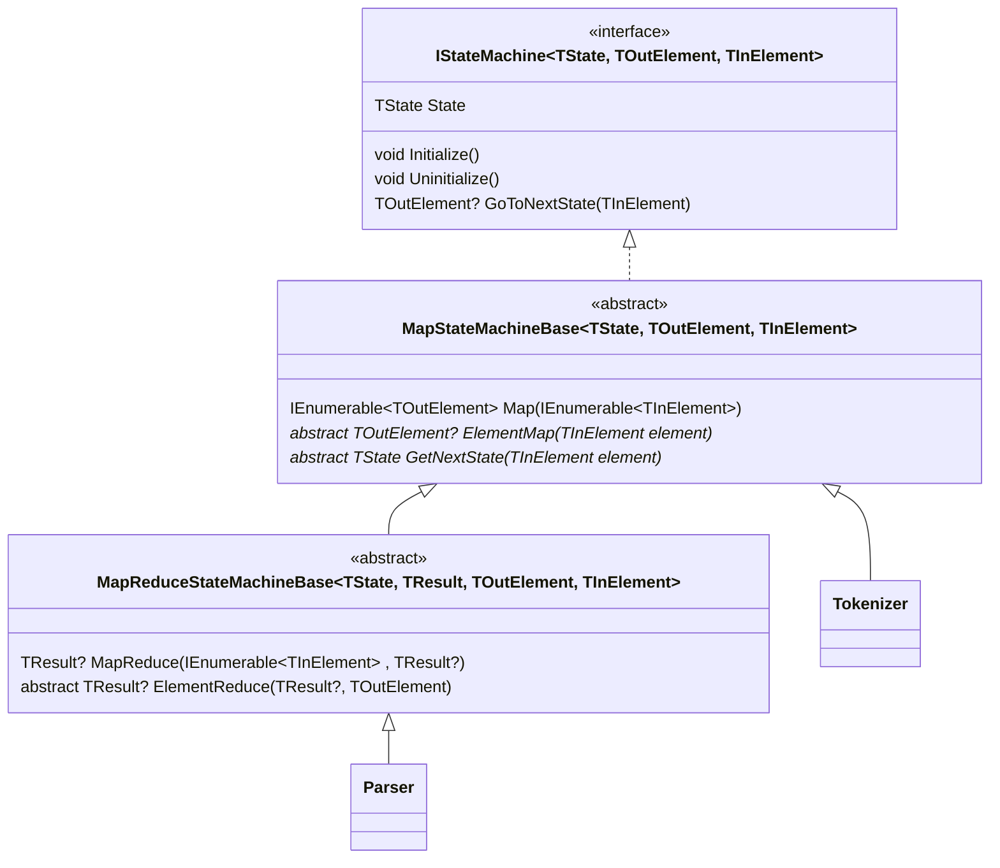

# 詳細設計(状態遷移フレームワーク)

## フレームワーク全体像

## クラス明細

### `IStateMachine<TState, TOutElement, TInElement>`

### `MapStateMachineBase<TState, TOutElement, TInElement>`

### `MapReduceStateMachineBase<TState, TResult, TOutElement, TInElement>`