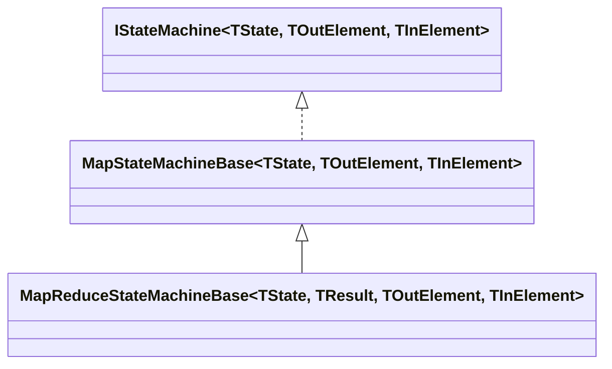
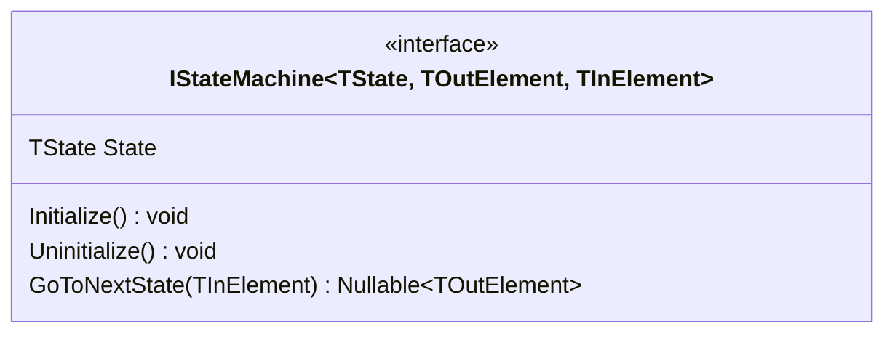
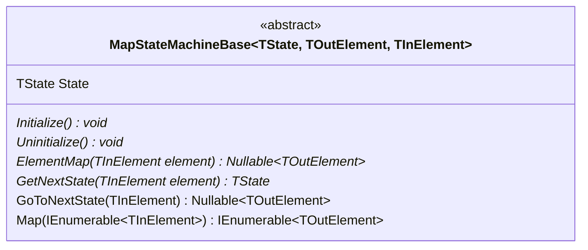
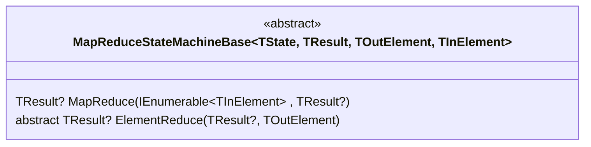

# 詳細設計(状態遷移フレームワーク)

## 概要

状態遷移機(ステートマシン)は本ライブラリの根幹にあり、ステートマシンを抽象化したクラスライブラリが**状態遷移フレームワーク**である。

> ここで、状態遷移機とは、以下のようなクラスをいう。
> 
> * 現在の**状態**を表すプロパティを有する。
> * **入力**を与えると、**状態** を次の**状態**に遷移させ、 **出力** を返却するメソッド(**状態遷移メソッド**)を有する。
> * **状態** や **入力**によって、**状態遷移メソッド**は**出力**はなくてもよい(戻り値はNull許容型である)。
> * 初期状態に強制的に戻すメソッドがある(`Initialize()`)。
> * すべての処理を完了させるメソッドがある(`Uninitialize()`)。

## フレームワーク全体像

### クラスインタフェース一覧

| クラス名                    | クラスインタフェース | 概要                                                            |
| --------------------------- | -------------------- | --------------------------------------------------------------- |
| `IStateMachine`             | `interface`          | ステートマシンのインタフェースを定義する。                      |
| `MapStateMachineBase`       | `abstract class`     | 単純なステートマシンを実装す抽象クラス                          |
| `MapReduceStateMachineBase` | `abstract class`     | `MapStateMachineBase`の実行結果を集約する機能も有する抽象クラス |

### クラスインタフェース継承関係

## クラス明細

### `IStateMachine<TState, TOutElement, TInElement>`

ステートマシンのインタフェースを定義するインタフェース

| メソッド名                               | 概要                                 |
| ---------------------------------------- | ------------------------------------ |
| `Initialize()`                           | 状態の初期化                         |
| `Uninitialize()`                         | すべての状態が終了し事を表す終了処理 |
| `TOutElement? GoToNextState(TInElement)` | 状態を遷移させる                     |

### `MapStateMachineBase<TState, TOutElement, TInElement>`

| メソッド名                                              | 概要                                       |
| ------------------------------------------------------- | ------------------------------------------ |
| `Nullable<TOutElement> ElementMap(TInElement element)`  | 入力に対する出力を定義する抽象メソッド     |
| `TState GetNextState(TInElement element)`               | 入力に対する次の状態を定義する抽象メソッド |
| `IEnumerable<TOutElement> Map(IEnumerable~TInElement~)` | 入力の列挙を出力の列挙に変換する           |

> 本クラスを具象化する場合、`ElementMap()`および`GetNextState()`を実装すること

### `MapReduceStateMachineBase<TState, TResult, TOutElement, TInElement>`

| メソッド名                                                | 概要                                         |
| --------------------------------------------------------- | -------------------------------------------- |
| `TResult? MapReduce(IEnumerable~TInElement~ , TResult? )` | 入力の列挙を出力列挙にし、集約して返却する。 |
| `TResult? ElementReduce(TResult?, TOutElement)`           | 出力を集約するアグリゲーターを実装する。     |

> 本クラスを具象化する場合、`ElementMap()`および`GetNextState()`、`ElementRedule()`を実装すること
