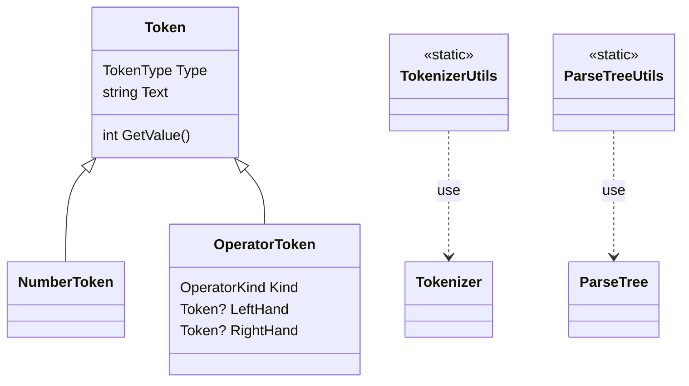
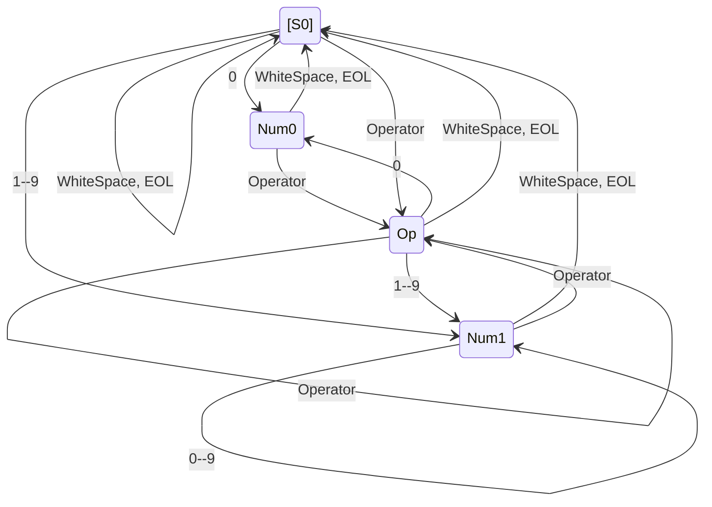
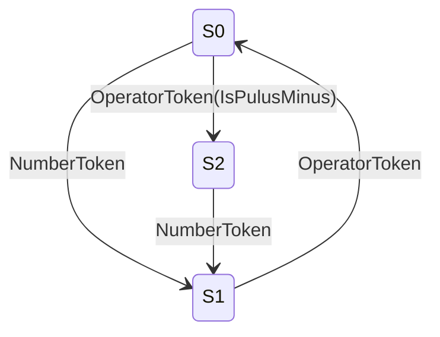

# メモ

## global class diagram

## Tokenizer

### 状態一覧

| 状態 | 概要                    |
| ---- | ----------------------- |
| [SO] | 初期状態                |
| Num0 | 数字`0`後区切り待ち状態 |
| Num1 | 数字`0`後区切り待ち状態 |
| Op   | 演算子後区切り待ち状態  |

### 状態遷移図

### 状態による処理対応表

| 状態     | 0                  | 1--9               | Operator           | WhiteSpace | EOL     |
| -------- | ------------------ | ------------------ | ------------------ | ---------- | ------- |
| **S0**   | `NewToken`         | `NewToken`         | `NewToken`         | -          | -       |
| **Num0** | *error*            | *error*            | `DrainAndNewToken` | `Drain`    | `Drain` |
| **Num1** | `KeepCharacter`    | `KeepCharacter`    | `DrainAndNewToken` | `Drain`    | `Drain` |
| **Op**   | `DrainAndNewToken` | `DrainAndNewToken` | `DrainAndNewToken` | `Drain`    | `Drain` |

## Parser

### 状態遷移図

### 状態遷移表

| 状態 | NumberToken  | OperatorToken(IsPlusMinus) | OperatorToken(Other) |
| ---- | ------------ | -------------------------- | -------------------- |
| S0   | AppendToTree | SetSign                    | Error                |
| S1   | Error        | SetOperator                | SetOperator          |
| S2   | AppendToTree | Error                      | Error                |

